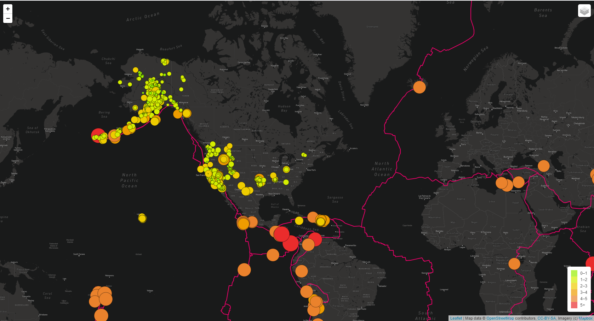
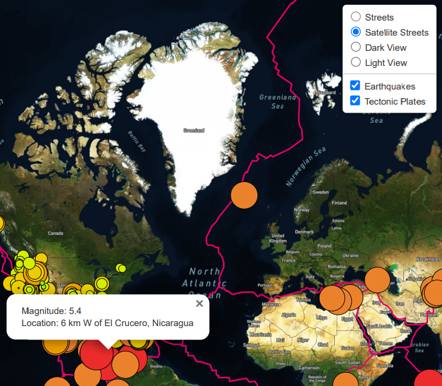
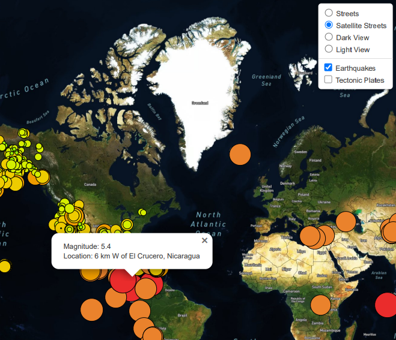
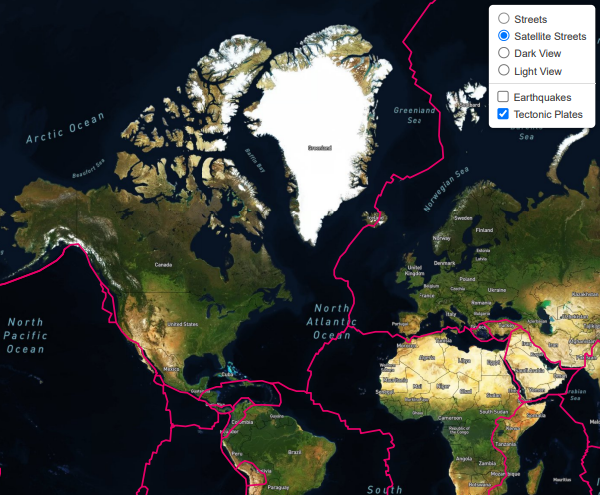

# Module 13 Challenge - Mapping Earthquakes

## Challenge Overview

The goals of this challenge are to:

- Use d3.json() to get tectonic plate data and add the data using the L.geoJSON() layer.
- Style the tectonic plate LineString data to stand out on the map.
- Add the tectonic plate data as an overlay with the earthquake data.
- Add a third map style to allow the user to select from three different maps.

## Resources
Data Sources: [logic](Earthquake_Challenge/static/js/logic.js), [index](Earthquake_Challenge/index.html), [css](Earthquake_Challenge/static/css/style.css)

Software: JavaScript (w/ Leaflet, D3), HTML, VSCode

## Results

## Report Completed By:

